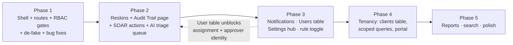

# OVS UI Implementation Gap Audit & Roadmap (refined, code-verified)

## Context

OVS is transitioning its dashboard to the July 2026 redesign (multi-client MSP console + client portal). This document is the gap audit and phased roadmap between the current Jinja2/Tailwind app and that design. **Deliverable of this session: this document only, committed to the repo (`docs/roadmap/UI_Implementation_Gap_Audit_2026-07.md`) via PR — no code changes.**

Decisions confirmed with user:
- **Design source**: the React handoff (`Design/OVS SECOPS_Design/design_handoff_audit_trail/` — `app.jsx`, `data.jsx`, `pages-audit.jsx`) is **not in the repo** (fresh clone has only the older `Design/*/code.html` Tailwind mockups; `docs/strategy/` referenced by CLAUDE.md is also absent — both presumably uncommitted local files). Per user decision: **proceed from the spec captured in this document** (nav structure, design tokens, page specs below are the authoritative extract); push the design files later for pixel-fidelity passes.
- **Nav authority**: design NAV_ADMIN/NAV_CLIENT is the base; brief-only items fold in as sections.
- **Stack**: keep Jinja2 + Tailwind + vanilla-JS fetch. No React migration.
- **Goal**: make the design a working product — no redesign.

### Verification status of claims in this document

Everything below marked with file:line was verified against the code on 2026-07-03 (commit `7f27c19`, branch `Master`). Corrections made to the original draft:
- `demo_suspicious_count` does **not** render blank — `network_investigation.html:241` uses `|default(8)`. Still demo data.
- The `analyst` role is **mintable** via env (`DASHBOARD_ROLE`/`CLIENT_ROLE` accept any string, `user_registry.py:47,53`) but only by sacrificing one of the two account slots; reconciliation still needed, just not a hard blocker.
- `/logout` exists as POST with form-CSRF (`routers/auth.py:80`) — the gap is purely a missing UI button.
- Design tokens (IBM Plex, 232px sidebar, 56px topbar) come from the missing design files; current `base.html` uses `w-72` sidebar / `h-16` topbar — treat exact px as to-be-confirmed when design files land.

---

## 1. Executive Summary

The current app is a working single-tenant SOC dashboard (16 templates, ~30 JSON endpoints) whose **core detection→alert→investigate→SOAR→triage loop is real and DB-backed**. The design assumes a larger product: multi-client MSP console + client portal + notifications + reports + user management + audit trail UI.

**Solid today**: alerts queue + stats (`api_metrics.py:88-187`), alert investigation (assessment/SOAR/AI-triage fully wired), agents lifecycle, logs search, SOAR history + approval workflow (simulation-only by design), system health rules, session auth with roles + CSRF.

**Four structural gaps** (everything else is cosmetic or route plumbing):
1. **No multi-tenancy** — no `client_id` anywhere; "client" is a login role that sees *all* data. Clients/portal area needs a tenant model first.
2. **No audit trail exposure** — `ActivityAudit` (`models.py:82`) + `audit_service.record_audit_event`/`list_audit_events` exist and are called from auth, api_metrics, agents, ai_triage, dashboard, and `soar/response_service.py` — but no route/template/export reads them.
3. **No notifications subsystem** — zero backend (no model, no SMTP/webhook code, no env vars in code despite CLAUDE.md listing them as sprint targets).
4. **No user management** — two env-var accounts (`auth/user_registry.py`); no `User` table, no CRUD.

Plus one **security-relevant UX gap**: the sidebar (`templates/base.html:79-171`) shows every link to every role, and HTML pages `soar/history`, `soar/settings`, `system-health-rules` are served to `client` users because all of `dashboard.py` mounts under `require_html_auth` only (`main.py:145`); only `rules.py` gets `require_admin_html` (`main.py:147`). The new shell must be role-aware **and** server-side gated.

---

## 2. Current System vs Design — Gap Summary

| Area | Current state | Design expects | Gap size |
|---|---|---|---|
| Shell/nav | 2-group static sidebar, no logout button, hardcoded "JD" card (`base.html:163-168`), dead "Clients" link (`base.html:137-141`), fake search box, "v2.0.0 Prototype" label | 6-group role-aware sidebar, badges, real user chip, ⌘K search, notification bell, client-portal shell variant | Medium (template work) |
| Dashboard | Real KPIs/charts via fetch; hardcoded "running stable" banner (`dashboard.html:35`) + "T1059.004 coverage" card (`dashboard.html:119`) | Overview with sparklines, fleet map, MITRE snapshot | Small–medium |
| Alerts / Investigation | Real, fully wired (assessment, SOAR, AI triage) | Same + assignment, richer filters | Small |
| Agents | Real (list/deploy/detail/history) | Same + client column, key-rotation age, silent-state UX | Small |
| Network | Page exists; flows/topology/risk are demo with 11 in-template TODOs (`network_investigation.html`) | Flow table with scores/geo/tags | Large (needs flow data model — or de-scope) |
| Detection rules | Read-only HTML list of YAML rules; dead `rule_edit.html` template | Rules table w/ enable toggle, FP stats, MITRE coverage grid | Medium |
| AI triage | Per-alert trigger + latest result only (`ai_triage.py:40,57`) | Cross-alert triage queue/history page | Medium |
| SOAR | Per-alert recommend/run/approve/reject/history real (`soar.py`, simulation-only); no cross-alert pending page | SOAR page (playbooks + pending queue w/ badge) + history | Small–medium |
| Audit trail | Backend complete, UI absent | Full page (design handoff exists locally) | Medium (mostly frontend) |
| Notifications | Absent | Channels + delivery feed | Large (backend first) |
| Reports | Absent (zero export code) | Reports page + export | Large (backend first) |
| Users & RBAC | Env-var accounts | Users & RBAC page | Large (backend first) |
| Clients + portal | Absent (old mockup `Design/clients/code.html` only) | Client list/detail + 7-screen read-only portal | Largest (tenancy first) |

---

## 3. Route Mapping Table

Existing routes verified in `api/app/main.py:140-156`, `routers/dashboard.py`, `routers/rules.py`, `routers/auth.py`, `routers/api_metrics.py`, `routers/soar.py`, `routers/settings.py`, `routers/system_health_rules.py`.

| Design Screen | Expected Path | Existing Path | Status | Required Action |
|---|---|---|---|---|
| Login | `/login` | `/login` (GET+POST, `auth.py:30,35`) | Working | Keep; reskin Phase 5 |
| Root landing | `/` | — (404) | Missing | Add redirect `/` → `/dashboard` (→ `/login` if unauthenticated) |
| Overview | `/dashboard` | `/dashboard` (`dashboard.py:23`) | Needs redesign integration | Keep route; replace template; remove hardcoded banner + T1059 card |
| Alerts | `/alerts` | `/alerts` (`dashboard.py:34`) | Needs redesign integration | Keep route; add status/date filters |
| Alert detail | `/alerts/{id}` | — | Missing | Redirect → `/alerts/{id}/investigation` |
| Investigation | `/alerts/{id}/investigation` | exists (`dashboard.py:234`) | Working | Reskin only — APIs already wired |
| Agents | `/agents` | `/agents` (`dashboard.py:132`) | Needs redesign integration | Keep route; replace template |
| Agent Deployment | `/agents/deploy` | `/agents/new` (GET+POST, `dashboard.py:149,169`) | Path mismatch | Rename; redirect from `/agents/new`; restrict POST to admin |
| Agent detail | `/agents/{id}` | exists (`dashboard.py:295`) | Working | Reskin; surface silent status + key age |
| Agent history | (section of Agents/Audit) | `/agents/history` (`dashboard.py:254`) | Needs integration | Keep short-term; later merge into Audit Trail |
| Clients (list) | `/clients` | — (dead `#` sidebar link) | Backend missing | Tenancy first (Phase 4); remove dead link now |
| Client detail | `/clients/{id}` | — | Backend missing | Phase 4 |
| Network | `/network` | `/network` (`dashboard.py:268`) | Demo data | Keep route; real per-agent counters; badge flow table DEMO or de-scope |
| Detection Rules | `/detection/rules` | `/rules` (`rules.py:10`, admin-gated) | Path mismatch | Rename + redirect; JSON API; toggle later |
| MITRE Coverage | `/detection/mitre` | — | Missing | Aggregate from YAML rule loader `mitre` fields — real data, small endpoint |
| AI Triage | `/ai-triage` | — (only per-alert `/api/alerts/{id}/ai-triage*`) | UI missing | New route + cross-alert list endpoint over `ai_alert_triages` |
| SOAR (actions + pending) | `/soar/actions` | — (approve/reject at `soar.py:50,72`; history per-alert) | UI missing | New page: playbooks (YAML loader) + pending-approval queue |
| SOAR Approvals | `/soar/approvals` | — | UI missing | Tab/anchor of `/soar/actions` |
| SOAR History | `/soar/history` | exists (`dashboard.py:280`) | Working | Reskin; **remove client access** |
| SOAR Settings | (inside Settings) | `/soar/settings` (`dashboard.py:275`) | Fragmented | Merge into `/settings`; redirect |
| Reports | `/reports` | — | Backend missing | Disabled/"coming soon" until export backend |
| Notifications | `/notifications` | — | Backend missing | Backend first (Phase 3) |
| Users & RBAC | `/settings/users` | — | Backend missing | Needs `User` table |
| Settings | `/settings` | fragments: `/soar/settings`, `/system-health-rules` HTML (`dashboard.py:29`), `/api/settings/soar` (`settings.py:26,37`) | Fragmented | New `/settings` hub; redirects from old paths |
| Audit Trail | `/audit` | — | Backend ready, UI absent | New route + `/api/audit/events` + CSV export |
| Logs | *(not in design nav — keep)* | `/logs` (`dashboard.py:85`) | Working | Keep under SYSTEM or ASSETS group |
| Rule editor | — | `rule_edit.html` (no route; also in `templates_old/`) | Dead | Delete (+ `api/templates_old/`, orphan `api/static/app.css`) |
| Client Portal (7 screens) | `/client/*` | — | Missing everything | Phase 4/5, after tenancy |
| Agent rule sync (Go agent) | `/api/agent/rules` | — (exempted `auth/session_middleware.py:31`; polled `agent/cmd/agent/main.go:64`; **no route registered**) | Bug | Register endpoint or remove agent polling — agent 404s every 5 min today |

---

## 4. Sidebar / Navigation Audit

Current sidebar: `api/templates/base.html:79-171` — groups **Monitoring** (Dashboard, Agents, Alerts, Logs, Network) and **System** (Detection Rules, System Health Rules, dead Clients `#`, SOAR Settings, SOAR History). No role conditionals, no badges, no logout, hardcoded "JD / admin@ovs-siem.io", decorative search/bell, "v2.0.0 Prototype".

Target = design `NAV_ADMIN` (captured below — design files not in repo) + brief items folded in:

| Group | Item | Route | Route exists | Real data | Role visibility | Badge | Notes |
|---|---|---|---|---|---|---|---|
| COMMAND | Overview | `/dashboard` | ✅ | ✅ (minus hardcoded bits) | all | — | Remove fake status banner |
| COMMAND | Alerts | `/alerts` | ✅ | ✅ | all | ✅ unread count from `/api/alerts/stats` (`api_metrics.py:130`) | |
| COMMAND | Investigation | `/alerts/{id}/investigation` | ✅ | ✅ | all (client: hide SOAR/triage controls) | — | Not a standalone nav target; design shows sample id — make "last opened" or hide |
| ASSETS | Agents | `/agents` | ✅ | ✅ | all | optional silent-count | |
| ASSETS | Clients | `/clients` | ❌ | ❌ no tenancy | admin/analyst | — | Remove dead link now; "coming soon" until Phase 4 |
| ASSETS | Network | `/network` | ✅ | ⚠️ mostly demo | all | — | Badge demo sections |
| DETECTION | Detection Rules | `/detection/rules` | ⚠️ at `/rules` | ✅ read-only YAML | admin (consider analyst read) | — | Rename + redirect |
| DETECTION | AI Triage | `/ai-triage` | ❌ | backend partial | admin/analyst | — | Needs queue endpoint |
| DETECTION | MITRE Coverage *(brief add-on)* | `/detection/mitre` | ❌ | derivable from YAML | admin/analyst | — | Small real endpoint |
| RESPONSE | SOAR | `/soar/actions` | ❌ | backend ready | admin/analyst | ✅ pending-approval count (real query) | Design badge "2" = pending approvals |
| RESPONSE | SOAR History | `/soar/history` | ✅ | ✅ | admin/analyst | — | Client must NOT see (currently can) |
| ADMIN | Reports | `/reports` | ❌ | ❌ | admin | — | Disabled until export backend |
| ADMIN | Notifications | `/notifications` | ❌ | ❌ | admin | delivery-failure count (later) | Backend first |
| ADMIN | Users & RBAC | `/settings/users` | ❌ | ❌ env-var users | admin | — | Needs `User` table |
| SYSTEM | Settings | `/settings` | ❌ fragments | ✅ for SOAR mode + health rules | admin | — | Consolidation page |
| SYSTEM | Audit Trail | `/audit` | ❌ | ✅ backend ready | admin (analyst read optional) | — | First full-page build |
| *(keep)* | Logs | `/logs` | ✅ | ✅ | all | — | Design omission; keep |

Client-portal sidebar (`NAV_CLIENT`: Overview, My Agents, Security Events, Reports, Monthly Posture, Support, My Account): **nothing exists**; requires tenancy. Do not render any of it until tenant scoping is enforced server-side.

Shell fixes independent of nav items: **logout** button (POST `/logout` + form CSRF exists at `auth.py:80` — just needs a form in the shell); user chip bound to `request.state.user` (set by `auth/session_middleware.py`); implement or remove topbar search; single-source version label; sidebar footer fleet stats bound to `/health` + real agent counts.

---

## 5. Missing Function Analysis

| New Function | Current Support | Missing Backend/Data | Missing UI | Priority |
|---|---|---|---|---|
| Audit trail page + filters + drawer | `ActivityAudit` model + `record_audit_event`/`list_audit_events` working; called from auth, api_metrics, agents, ai_triage, dashboard, soar `response_service.py` | JSON endpoint; CSV export; `source_ip` column (today only inside `details` for auth events); audit of config changes (`settings.py` + `system_health_rules.py` writes are **unaudited** — verified no `record_audit_event` calls) | Entire page | **P1** |
| Client/tenant list + detail | Nothing (role ≠ tenant) | `Client` table; `client_id` FK on `agent_records` (min) + joined onto alerts; scoped queries; migration | Clients pages | P3 backend, P4 UI |
| Client read-only portal | Nothing | Tenant scoping in every query; client-user↔client mapping; portal shell | All portal pages | P4 |
| Notification center + channels | Nothing | `NotificationChannel` + `NotificationDelivery` models; SMTP/webhook senders; alert-triggered dispatch; retry/failure state | `/notifications` page; bell dropdown | **P2** (CLAUDE.md sprint target) |
| Agent dead-silence alerting | `compute_agent_status` hardcodes offline at 5 min (`agent_service.py:27`); no alert emitted | Honor `AGENT_SILENCE_THRESHOLD_MINUTES`; background sweep emitting Alert + notification | Silent badge on Agents + Overview | P2 |
| Detection rule management UI | Read-only YAML list; vestigial `DetectionRule` DB table | Rules stay files (detection-as-code). Toggle = suppression entry or `enabled` flag where loader reads it; JSON API | Rules table w/ toggle, FP stats (derivable from `alerts.rule_id`) | P3 |
| MITRE coverage matrix | `mitre` fields in YAML rules + `mitre_mapper.py` | Aggregation endpoint (tactic × technique → rule count) | Grid render | P3 |
| AI triage queue page | Per-alert trigger + `latest` (`ai_triage.py:40,57`); all runs stored in `ai_alert_triages` | Paginated cross-alert list endpoint | Queue page | P2 |
| Pending SOAR approvals page | Approve/reject endpoints + `pending_approval` status real (`soar.py:50,72`) | Cross-alert list-pending endpoint | Pending tab w/ approve/reject + notes | P2 |
| SOAR decision notes | Only `approved_by/rejected_by` + timestamps | `decision_note` column on `SOARActionExecution` | Note field in dialogs | P2 |
| Alert status in queue | ✅ `AlertAssessment` (New/Investigating/Resolved/FP), audited | — | Show status column in `/alerts` list | P1 (cheap) |
| Alert assignment | Nothing | `assigned_to` on `AlertAssessment`; meaningful only after User table | Assignee dropdown | P3 |
| Alert suppression from UI | Suppression YAML, detection-side only | Endpoint writing tuning entries (admin, audited) | "Suppress pattern" action | P3 |
| Advanced alert filters | severity/source/host/read only | Extend `/alerts` query params (status, date range, MITRE) | Filter bar | P2 |
| Users & roles CRUD | Env registry (2 accounts; role strings are env-configurable per `user_registry.py:47,53` — analyst mintable but only by consuming an account slot) | `User` table + hashing + CRUD + seed/migrate env accounts | `/settings/users` | P3 |
| Reports / evidence export | Nothing | StreamingResponse CSV (audit first, alerts second); PDF later/never | Export buttons | P3 (audit CSV rides P1) |
| Saved filters | Nothing | localStorage v1 (no table) | Chip UI | P5 |
| Global search / ⌘K | Fake input | Cross-entity search endpoint | Palette | P5 |
| Network flow detail | Coarse per-agent byte counters; flow table demo | Flow data model + agent capability (big) — or de-scope to per-agent traffic | Real flow table | P5 / de-scope |

---

## 6. Page-by-Page Implementation Notes

Format: **Status → Route → Data → Role → Actions → Placeholder risk**. Server-rendered pages get empty/populated states free; fetch-driven panels need JS loading/error handling (currently mostly absent).

1. **Overview** — works, needs reskin + de-fake. `/dashboard`. Real `/api/metrics/*` + `/api/alerts/*`; remove `dashboard.html:35` "running stable" banner and `:119` T1059 coverage card (or compute from rules). Risk: fake "stable" banner on a security product misleads operators — **remove even before reskin**.
2. **Alerts Queue** — working, real. Add assessment-status column + date filter. Client: read-only, no mark-read. Risk low.
3. **Investigation** — strongest page; all panels fetch real APIs. Add `/alerts/{id}` redirect. SOAR run analyst+; approve/reject admin; hide action buttons for client (template already receives `user_role`). Remove two disabled stub header buttons. Risk low.
4. **AI Triage queue** — new `/ai-triage` + `GET /api/ai-triage/results?status=&page=`. If `AI_TRIAGE_ENABLED` false show config notice, not error. Verdicts rendered as **advisory** (product rule). Risk medium.
5. **SOAR History** — working. **Gate from client role.** Add decision-note display + timeline. Risk low.
6. **Pending SOAR Approvals** — backend ready, no page. Tab of `/soar/actions`; new cross-alert `status=pending_approval` list endpoint. Approve/reject with required note; show simulation-mode banner. Risk high if fudged — approvals are the safety gate (already audited server-side via `response_service.py`).
7. **Agents** — working. Add silent/offline dot semantics, key-rotation age, deploy link. Delete admin-only (already). Risk low.
8. **Agent Deployment** — working wizard at `/agents/new` (GET+POST). Rename to `/agents/deploy` + redirect. **Restrict creation to admin** (today any authenticated user can POST — verified `dashboard.py:169` under plain `require_html_auth`). Risk low.
9. **Network** — ~90% demo (hardcoded flows/topology/risk; 11 TODOs in template). v1 = real per-agent net counters + alert map; flow table badged "DEMO" or removed. Risk: **highest fake-data page in the app**.
10. **Detection Rules** — real read-only YAML list at `/rules` (admin-gated). Rename to `/detection/rules`; FP counts from `alerts.rule_id`. v1 view-only; v2 enable/disable via suppressions. Delete `rule_edit.html`. Risk low.
11. **MITRE Coverage** — new; cheap and real (aggregate YAML `mitre` fields; 5 active rules → sparse grid is honest). Do **not** replicate the design's dense grid (design's `MITRE_GRID` is `Math.random`-seeded prototype fiction).
12. **Clients list/detail** — absent; needs tenancy (Phase 4). Do not ship UI over a fake client list.
13. **Client Portal** — absent; requires client-user↔client_id binding, tenant-filtered queries server-side, portal-safe serializers (no rule internals, no SOAR, no other tenants). **The** tenant-isolation risk.
14. **Audit Trail** — backend done, UI absent. `/audit` + `GET /api/audit/events` (server-side filter/pagination) + `GET /api/audit/export.csv`. Server gaps: `source_ip` column (or record IP in details for all events); emit `SYSTEM_CONFIG_CHANGED` from settings + health-rule writes; redaction guarantee (`__SENSITIVE__` chip contract — `audit_service._sanitize_details` truncates but trusts callers; add a scrub list). 12 rows/page, KPI cells, detail drawer with links to `/alerts/{id}/investigation`, `/soar/history`, `/agents/{id}`. Risk low — read-only; highest-value first build.
15. **Notifications** — absent everywhere. Channel + delivery models, SMTP/webhook senders (env vars documented in CLAUDE.md, absent in code). Test-send is the killer feature. Delivery log with failure reason. Backend first.
16. **Settings hub** — fragmented today (SOAR settings HTML, health-rules HTML, `/api/settings/soar` JSON). New `/settings`: SOAR mode, health thresholds, retention (verify `LOG_RETENTION_DAYS` is actually implemented before exposing a knob), session policy read-only. **All writes must call `record_audit_event`** (currently none do — verified).
17. **Users & Roles** — absent. `User` table (username, bcrypt hash, role, is_active, created), seed the two env accounts, keep env fallback for bootstrap. Every mutation audited. Unblocks alert assignment + real approver identities.

---

## 7. Recommended Route Structure

Access: **A**=admin, **N**=analyst, **C**=client, all=A N C.

| Route | Access | Notes |
|---|---|---|
| `/` | any | 302 → `/dashboard` (or `/login`) — new |
| `/login`, `/logout` | public/any | exists |
| `/dashboard`, `/alerts`, `/logs` | all | exist |
| `/alerts/{id}` | all | new → 302 investigation |
| `/alerts/{id}/investigation` | all (C read-only) | exists |
| `/ai-triage` | A N | new |
| `/agents` | all | exists |
| `/agents/deploy` | A | rename of `/agents/new` |
| `/agents/history` | A N | exists |
| `/agents/{id}` | all | exists |
| `/network` | A N | exists |
| `/detection/rules` | A, N read | rename of `/rules` |
| `/detection/mitre` | A N | new |
| `/soar/actions` | A N | new (playbooks + pending) |
| `/soar/approvals` | A | anchor/tab of actions |
| `/soar/history` | A N | exists — **remove client access** |
| `/reports` | A | Phase 3+, disabled until backed |
| `/notifications` | A | Phase 3 |
| `/audit` | A | new |
| `/settings` | A | new hub |
| `/settings/users` | A | Phase 3 |
| `/clients`, `/clients/{id}` | A N | Phase 4 |
| `/client/dashboard`, `/client/agents`, `/client/alerts` | C only (tenant-bound) | Phase 4/5 |

JSON: keep existing; add `GET /api/audit/events`, `GET /api/audit/export.csv`, `GET /api/ai-triage/results`, `GET /api/soar/pending`, `GET /api/detection/rules`, `GET /api/detection/mitre-coverage`; later `/api/users`, `/api/notifications/*`, `/api/clients/*`. Fix or remove `/api/agent/rules` (agent polls every 5 min; middleware exempts it; **no route registered** — verified).

Redirects (302 GET): `/` → `/dashboard`; `/agents/new` → `/agents/deploy`; `/rules` → `/detection/rules`; `/soar/settings` → `/settings#soar`; `/system-health-rules` → `/settings#health` (old templates keep serving until the settings hub exists — redirect only after). Keep POST handlers on old paths during transition or update forms atomically.

---

## 8. Implementation Phases

**Phase 1 — Shell, routes, honesty pass** (no new features)
- New `base.html` shell per design: 6-group role-aware sidebar (hide admin groups from client), real user chip from `request.state.user`, logout form button, alert-count badge from `/api/alerts/stats`, remove dead Clients link + fake search/bell.
- Route renames + redirect table; `/` redirect; typed 404 page.
- Server-side gates: `require_admin_html`-style deps on `soar/history`, `soar/settings`, `system-health-rules` HTML, agents/new POST (split `dashboard.py` router mounting or per-route dependencies).
- De-fake: remove dashboard banner + T1059 card; badge network demo sections "DEMO"; delete `api/templates_old/`, `rule_edit.html`, orphan `api/static/app.css`.
- Bug fixes: `agent_service.py:190` (`token_expires_at` → `registration_token_expires_at`; expiry currently not persisted on regenerate — verified against `models.py:140`); `/api/agent/rules` (register minimal endpoint or remove agent polling).

**Phase 2 — Core SOC pages on the new design**
- **Audit Trail first** (recommended): `/audit` + events/export endpoints + `source_ip` + audit settings writes.
- Reskin order: Alerts → Investigation → Agents(+deploy/detail) → Dashboard → SOAR History → Logs. All real data already.
- `/soar/actions` with pending tab + `decision_note` migration; `/ai-triage` queue + list endpoint.
- Loading/error states for all fetch panels.

**Phase 3 — New product functions** (backend-first)
- Notifications (models, senders, dispatch, page, test-send). Agent dead-silence sweep honoring `AGENT_SILENCE_THRESHOLD_MINUTES`.
- `User` table + `/settings/users` CRUD (audited); reconcile analyst role; then alert assignment.
- `/settings` hub consolidation — every write audited.
- `/detection/rules` JSON + toggle via suppressions; `/detection/mitre`.

**Phase 4 — Client/tenant layer**
- `clients` table; `client_id` on `agent_records` (+ join/denorm to alerts/metrics/logs); migration assigning existing data to a default client.
- Tenant scoping enforced in the service layer (single choke point — the v2.9.0 service extraction helps); client-user↔client binding.
- `/clients` admin views; then read-only portal with portal-safe serializers.
- Security review + tests proving cross-tenant reads impossible **before** portal login exists.

**Phase 5 — Polish & production UX**
- Reports/exports, saved filters, ⌘K search, bell dropdown, network flow model (or formal de-scope), skeletons/empty states, responsive off-canvas sidebar, accessibility, portal secondary screens or defer.

---

## 9. High-Risk Issues to Fix First

1. **Tenant isolation does not exist** — nothing client-facing ships before Phase 4 scoping. Interim Phase-1 fix: role-gate HTML routes.
2. **Client role over-exposure (now)** — `soar/history`, `system-health-rules`, `soar/settings` HTML render for client role (all under `require_html_auth` only, `main.py:145`). Sidebar hiding is not enough; server-side deps required.
3. **`analyst` role semi-ghost** — `require_analyst_auth` (`auth/dependencies.py:41`) guards SOAR run; env registry can mint the role only by consuming one of two account slots. Reconcile before role-based UI, or SOAR-run is admin-only in practice.
4. **Settings/config changes unaudited** — `settings.py` and `system_health_rules.py` writes never call `record_audit_event` (verified); the audit page's promised `SYSTEM_CONFIG_CHANGED` events are never produced.
5. **Fake data presented as real** — dashboard "stable" banner, T1059 card, network flows/topology. Fix in Phase 1 (remove or badge DEMO).
6. **Agent key-rotation bug** — `agent_service.py:190` sets non-existent `token_expires_at` (model field: `registration_token_expires_at`, `models.py:140`); regenerated-token expiry isn't persisted. One-line fix + test.
7. **`/api/agent/rules` missing** — Go agent (`main.go:64`) polls every 5 min; middleware exempts (`session_middleware.py:31`); no route → permanent 404s.
8. **No logout affordance** — POST `/logout` exists (`auth.py:80`) but no UI form; 8h sessions can't be ended from the UI.
9. **Audit export must never leak secrets** — server-side redaction contract before CSV ships; `audit_service._sanitize_details` truncates but trusts callers.
10. **SOAR UI must state simulation mode** — backend hard-locks simulation; label executions "SIMULATED". AI triage stays advisory-only.

Design-prototype fictions — do not implement as-is: random-seeded MITRE grid, "241/256" fleet footer (bind to real counts), fake notifications feed, fake client list, playbook `mode:'auto'` examples, Reports page content.

---

## 10. First Development Tasks (post-approval of this document)

**Task 1 (1 PR): Phase-1 shell + routing alignment** — new role-aware `base.html`, redirects, RBAC gates, de-fake, dead-template cleanup, bugs #6/#7. Every design page gets a working route or is absent from nav — no dead links. *Blocked on design files only for pixel-fidelity; structure/nav/tokens are captured above.*

**Task 2 (next PR): Audit Trail end-to-end** — only screen with a complete handoff (push `pages-audit.jsx` to the repo before this task), backend service working, read-only, exercises the new shell.

## Verification

- **This session**: commit this document to `docs/roadmap/UI_Implementation_Gap_Audit_2026-07.md` on a branch, open a PR. No code changes.
- Phase 1 (later): click every sidebar item as admin and as client — no 403 surprises, no dead links; old bookmarks redirect; logout works; `curl -I /` redirects; `cd api && python -m pytest app/detection/tests/ -v` plus `app/tests/` still pass.
- Audit page (later): login/logout, status change, SOAR approve, key rotation → rows appear with correct filters; CSV contains no secrets; non-admin gets 403.
